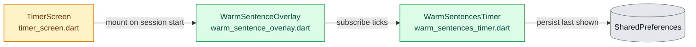
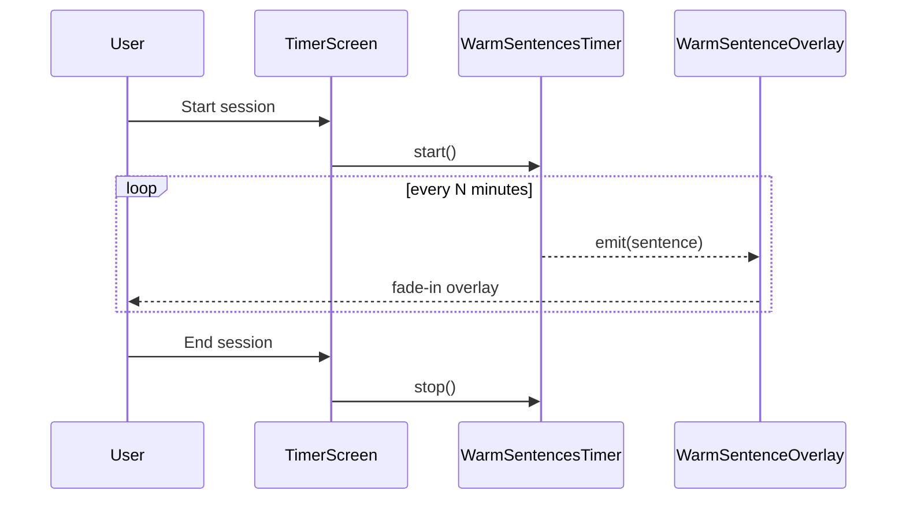

# Plan Creation Stage

Based on our full exchange, produce a markdown plan document.

**Before writing the plan:** Apply first-principles thinking to determine the most maintainable, minimal, and optimal code architecture—and the best execution order. Every architectural decision and step sequence should follow from this analysis, not from habit or over-engineering.

Requirements for the plan:

- Include clear, minimal, concise steps.
- Track the status of each step using these emojis:
  - 🟩 Done
  - 🟨 In Progress
  - 🟥 To Do
- Include dynamic tracking of overall progress percentage (at top).
- Do NOT add extra scope or unnecessary complexity beyond explicitly clarified details.
- Steps should be modular, elegant, minimal, and integrate seamlessly within the existing codebase.
- Architecture and step order must reflect first-principles analysis: simplest correct design, fewest moving parts, best fit with existing patterns.

Markdown Template:

# Feature Implementation Plan

**Overall Progress:** `0%`

## TLDR

Short summary of what we're building and why.

## Critical Decisions

> **范式（必须遵循）：** 本板块须基于第一性原理深度思考，论证出**可维护性最强、最精简、最佳的代码架构**与**最佳执行顺序**。每条决策从问题本质出发推导，而非沿用习惯或过度设计——优先选最简单且正确的方案、最少的活动部件、与现有代码模式最契合的设计；执行顺序须说明为何如此排序（依赖关系 / 风险前置 / 可独立验证）。

Key architectural/implementation choices made during exploration (each grounded in first-principles reasoning):

| # | 决策 | 第一性原理依据 |
|---|------|----------------|
| 1 | [架构/实现选择] | [为何这是最精简、最可维护、最契合现有模式的方案] |
| 2 | [架构/实现选择] | [同上] |

## Architecture:

**架构图（必画）：** 基于上方 Critical Decisions 中的架构决策，使用 Mermaid 画出本次改动的架构图，让 reviewer 一眼看清模块边界、数据流与依赖方向。要求：

- 至少包含一张**模块/组件关系图**（`flowchart` 或 `graph`），标出新增/修改/复用的节点（用不同样式区分，例如 `:::new` / `:::changed` / `:::reuse`）。
- 如涉及状态变化、用户交互或异步流程，**额外加一张**对应的 `sequenceDiagram` 或 `stateDiagram-v2`。
- 节点命名须与"详细改动清单"中的文件/类/函数名一致，方便对照。
- 图须能独立读懂——必要时在图下方用 1–3 行 bullet 补充关键箭头/节点的含义。

**样例图（参考此风格，按本次实际架构替换内容）：**

样例 1 —— 模块关系图（`flowchart`）：

样例 2 —— 交互/状态流（`sequenceDiagram`）：

## Tasks:

**执行顺序依据：** [说明为何按此顺序执行 —— 依赖先行、风险前置、每步可独立验证]

- [ ] 🟥 **Step 1: [Name]**
  - [ ] 🟥 Subtask 1
  - [ ] 🟥 Subtask 2

- [ ] 🟥 **Step 2: [Name]**
  - [ ] 🟥 Subtask 1
  - [ ] 🟥 Subtask 2

...

**Plan document must include:** a complete **详细改动清单** (file-level changes with before/after where applicable) and a **手动测试清单** (grouped, checkbox-style items I can run through manually). These sections are mandatory—not optional appendices.

## 详细改动清单

> 按模块/文件列出具体改动，供实现与 review 对照。改 UI/文案时注明改前 → 改后。

### 1. [模块名]

| 位置 | 改前 | 改后 | 文件 |
|------|------|------|------|
| [描述] | [现状或无] | [目标] | `path/to/file.dart` |

### 2. [模块名]

| 位置 | 改动 | 文件 |
|------|------|------|
| [描述] | [具体改动说明] | `path/to/file.dart` |

### N. 自动化测试（如有）

| 测试文件 | 断言/覆盖 |
|----------|-----------|
| `test/xxx_test.dart` | [测什么] |

---

## 手动测试清单（供你逐项勾选）

> 按用户路径分组；每条可独立勾选。覆盖 happy path、边界、回归。

### A. [场景组名]

- [ ] **A1** [具体操作] → [预期结果]
- [ ] **A2** [具体操作] → [预期结果]

### B. [场景组名]

- [ ] **B1** [具体操作] → [预期结果]

### N. 回归 / 未改项确认

- [ ] **N1** [确认未受影响的功能点]

---

Again, it's still not time to build yet. Just write the clear plan document. No extra complexity or extra scope beyond what we discussed.

