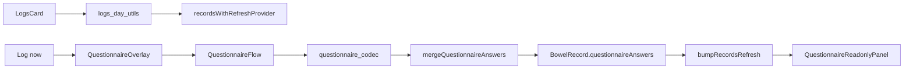
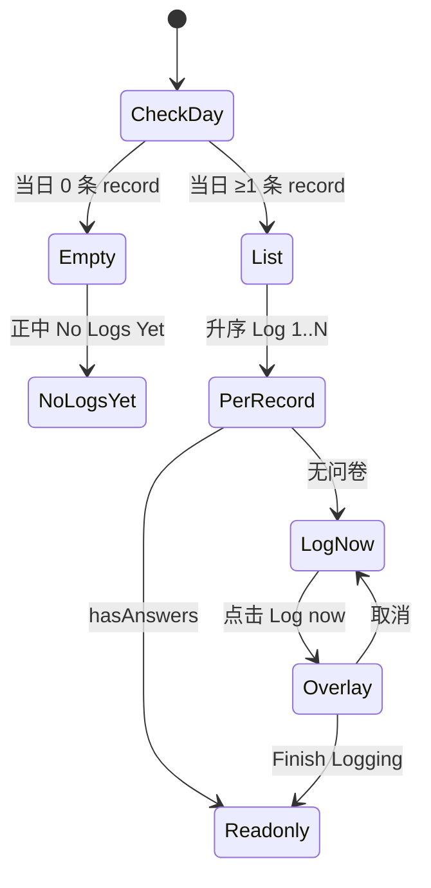

# ARCHIVE-001 Logs 页实施计划

**Overall Progress:** `88%`

## TLDR

在档案页 `new_archive_screen.dart` 新增第三页 **Logs**（Page index 2）：按天浏览当日 session；有问卷 → 只读展示；无问卷 →「Log X」+ **Log now** → 284×406 交互问卷浮层 → `>>Finish Logging` 落库 → 展开只读块。问卷领域逻辑抽到 `lib/features/questionnaire/` 跨页面复用；**唯一写入口** `mergeQuestionnaireAnswers` 写入 `BowelRecord.questionnaireAnswers`。

**不在范围：** 已填问卷的再编辑；record 删除 UI。

---

## Critical Decisions

| # | 决策 | 理由 |
|---|------|------|
| 1 | **共享模块放 `lib/features/questionnaire/`** | 问卷跨 Timer + Logs，不应由 `timer/` 独占 |
| 2 | **单一存储路径** `BowelRecord.questionnaireAnswers` | Chart / status_scoring 已消费此字段；无第二 Hive box |
| 3 | **单一写入口** `mergeQuestionnaireAnswers(recordId, answers)` | Logs Finish 调用；未来 Timer Finish 复用 |
| 4 | **玻璃统一用 `LiquidGlassBackground`** | 交互浮层 + 只读块；不用 `_TimerBlueGlassPanel` |
| 5 | **Layout 双模式** `compact(284×406)` / `full(screen比例)` | 同一交互 Panel，缩放 token 不同 |
| 6 | **只读 Panel 入参** `Map<String, List<int>> answers` | UI 与数据来源解耦；Phase 4 可用 mock 验样式 |
| 7 | **`hasAnswers(record)`** | `questionnaireAnswers != null && isNotEmpty`；空 map 等同无问卷 |
| 8 | **Logs 独立 `_currentDay`** | 与 Calendar `_currentMonth` 不强制同步 |
| 9 | **`logs_card.dart` 从 `new_archive_screen` 抽出** | 原文件 730 行，避免继续膨胀 |
| 10 | **timer 抽取改 import，本 ticket 不改 timer 落库** | 降低回归面；抽取后须做 timer 问卷交互回归 |
| 11 | **浮层取消** 点遮罩 + 系统返回 | 不保存；`PopScope` 先关浮层 |
| 12 | **浮层开时** `PageView physics: NeverScrollableScrollPhysics` | 防误滑切页 |

---

## 架构

```
new_archive_screen.dart（编排）
  ├── PageView page 2 → LogsCard
  ├── _currentDay 状态
  └── 3 点 page indicator

logs_card.dart（Logs 外壳 326×620）
  ├── 标题 / 日导航 / 滚动区
  ├── 三分支：No Logs Yet | Log X + Log now | ReadonlyPanel
  └── QuestionnaireOverlay（284×406）

logs_day_utils.dart（纯函数）
  ├── defaultDayFromRecords(all)
  ├── recordsForDay(all, day)
  └── hasQuestionnaireAnswers(record)

lib/features/questionnaire/
  ├── questionnaire_spec.dart       # QuestionId, options, nextQuestion
  ├── questionnaire_flow.dart         # 状态机
  ├── questionnaire_codec.dart        # FlowState → Map<String,List<int>>
  ├── questionnaire_layout_tokens.dart # compact / full 缩放
  └── widgets/
      ├── questionnaire_interactive_panel.dart
      ├── questionnaire_readonly_panel.dart
      └── questionnaire_overlay.dart

session_record_utils.dart（扩展）
  └── mergeQuestionnaireAnswers(recordId, answers) → saveRecord + return

records_provider.dart
  └── Finish 后 bumpRecordsRefresh(ref)

timer_screen.dart（瘦身）
  └── import questionnaire_*；删除内联 spec/状态机（行为保持一致）
```

### 数据流



### Log 条目状态



---

## UI 规格速查

| 元素 | 规格 |
|------|------|
| 外壳 | 326×620，同 `_LogCalendarCard` 玻璃 |
| 标题 Logs | `left:61, top:46`，白 25pt bold，letterSpacing 5 |
| 日导航 | `left/right:21, top:96`，±1 day |
| Log X | `left:21`；首条 `top:122`；蓝 `#0088FF` 20pt w400 |
| Log now | 首条 `left:21, top:162`；蓝 pill；多条动态下移 |
| No Logs Yet | 面板正中；SF Pro white 16 w300 |
| 浮层 | 284×406，`Center`；`LiquidGlassBackground`；比例缩小排版 |
| 只读块 | 仅已答题目+已选选项；蓝高亮；`LiquidGlassBackground` |

---

## Tasks

- [x] 🟩 **Step 1: Logs 页外壳（Phase 1）**
  - [x] 🟩 `new_archive_screen.dart`：PageView 加第三页；指示器改 3 点（可点击跳转 index 2）
  - [x] 🟩 新增 `_currentDay` 状态，默认日由 records 推导（无 record → `DateTime.now()`）
  - [x] 🟩 新建 `lib/features/archive/logs_card.dart`：326×620 玻璃卡片
  - [x] 🟩 标题 **Logs**、日导航行（`〈 MMMM d, yyyy 〉`，±1 day）
  - [x] 🟩 内容区 `SingleChildScrollView`（日期导航下方可滚动）
  - [x] 🟩 接入 `recordsWithRefreshProvider`，当日 records 传入 `LogsCard`

- [x] 🟩 **Step 2: 当日记录工具 + Log 条目三分支（Phase 2）**
  - [x] 🟩 新建 `lib/features/archive/logs_day_utils.dart`
    - [x] 🟩 `DateTime defaultDayFromRecords(List<BowelRecord> all)`
    - [x] 🟩 `List<BowelRecord> recordsForDay(all, day)` + `dateTime` 升序
    - [x] 🟩 `bool hasQuestionnaireAnswers(BowelRecord r)`
  - [x] 🟩 `LogsCard` 三分支渲染：
    - [x] 🟩 当日 0 条 → `Center` 显示 **No Logs Yet**
    - [x] 🟩 有 record 无问卷 → **Log X** + **Log now**（首条 21/122、21/162；多条动态下移）
    - [x] 🟩 有问卷 → **Log X** + 只读块
  - [x] 🟩 同日混合：每条 record 独立判断 hasAnswers / Log now

- [x] 🟩 **Step 3: 问卷领域层（Phase 2b）**
  - [x] 🟩 新建 `questionnaire_spec.dart`（迁出题目定义与分支）
  - [x] 🟩 新建 `questionnaire_codec.dart`（`encodeAnswers`，key=`q1...q102`）
  - [x] 🟩 新建 `questionnaire_flow.dart`（问卷状态机）
  - [x] 🟩 新建 `questionnaire_layout_tokens.dart`（`compact`/`full` 缩放）

- [x] 🟩 **Step 4: Timer 接入共享模块（回归前置）**
  - [x] 🟩 `timer_screen.dart` 删除内联 spec/状态机/问卷 UI 重复代码
  - [x] 🟩 改用 `QuestionnaireFlow` + `QuestionnaireInteractivePanel(layout: full)`
  - [x] 🟩 `_finishQuestionnaire` 行为不变（仍只 reset UI，不落库）
  - [ ] 🟨 行为回归：已完成静态与 lint 验证，待手工全链路点击确认

- [x] 🟩 **Step 5: 只读 Panel（Phase 4）**
  - [x] 🟩 新建 `questionnaire_readonly_panel.dart`
  - [x] 🟩 入参 `Map<String, List<int>> answers`，内部按 `questionnaire_spec` 解析
  - [x] 🟩 仅渲染已答题目 + 已选选项；蓝高亮 `#0088FF`
  - [x] 🟩 外包 `LiquidGlassBackground`，折叠题只读态展平
  - [x] 🟩 `LogsCard` 有问卷分支已接入 `QuestionnaireReadonlyPanel`

- [x] 🟩 **Step 6: 交互浮层（Phase 3）**
  - [x] 🟩 新建 `questionnaire_interactive_panel.dart`
  - [x] 🟩 新建 `questionnaire_overlay.dart`
    - [x] 🟩 284×406 居中，底层 `LiquidGlassBackground`
    - [x] 🟩 半透明 barrier 点击关闭（不保存）
    - [x] 🟩 `PopScope` 返回键先关闭浮层
    - [x] 🟩 浮层打开时通知父级禁用 `PageView` 滑动
  - [x] 🟩 `LogsCard`：`Log now` 打开 overlay，绑定当前 `record.id`
  - [x] 🟩 overlay 内 `QuestionnaireInteractivePanel(layout: compact)` + `>>Finish Logging`

- [x] 🟩 **Step 7: 落库与刷新（Phase 5）**
  - [x] 🟩 `session_record_utils.dart` 新增 `mergeQuestionnaireAnswers`
  - [x] 🟩 `LocalStorage.getRecord` → `copyWith(questionnaireAnswers)` → `saveRecord`
  - [x] 🟩 记录不存在时 `throw StateError`
  - [x] 🟩 overlay Finish：`encodeAnswers` → `mergeQuestionnaireAnswers` → `bumpRecordsRefresh(ref)`
  - [x] 🟩 落库后关闭浮层并刷新为只读块
  - [x] 🟩 取消路径不落库

- [ ] 🟥 **Step 8: 端到端验证**
  - [x] 🟩 已完成 `ReadLints` 静态检查（无新增 lint）
  - [ ] 🟥 三页滑动 + 3 指示器手测
  - [ ] 🟥 默认日、按天切换、升序 Log 1..N 手测
  - [ ] 🟥 零 session / 无问卷 / 有问卷三态手测
  - [ ] 🟥 Log now → Finish → Hive `questionnaire_answers` 手测
  - [ ] 🟥 浮层外 tap / 返回键关闭不保存手测
  - [ ] 🟥 浮层开时 PageView 禁滑手测
  - [ ] 🟥 timer 问卷交互回归手测

---

## 文件清单

| 操作 | 路径 |
|------|------|
| 改 | `lib/features/archive/new_archive_screen.dart` |
| 新建 | `lib/features/archive/logs_card.dart` |
| 新建 | `lib/features/archive/logs_day_utils.dart` |
| 新建 | `lib/features/questionnaire/questionnaire_spec.dart` |
| 新建 | `lib/features/questionnaire/questionnaire_flow.dart` |
| 新建 | `lib/features/questionnaire/questionnaire_codec.dart` |
| 新建 | `lib/features/questionnaire/questionnaire_layout_tokens.dart` |
| 新建 | `lib/features/questionnaire/widgets/questionnaire_interactive_panel.dart` |
| 新建 | `lib/features/questionnaire/widgets/questionnaire_readonly_panel.dart` |
| 新建 | `lib/features/questionnaire/widgets/questionnaire_overlay.dart` |
| 改 | `lib/features/timer/timer_screen.dart` |
| 改 | `lib/features/timer/session_record_utils.dart` |
| 不改 schema | `lib/models/bowel_record.dart` |
| 不改 API | `lib/services/local_storage.dart` |

---

## 风险与回滚

| 风险 | 缓解 |
|------|------|
| timer 抽取回归 | Step 4 专门回归；先抽领域再改 UI |
| 284×406 内容溢出 | compact layout + 浮层内 `SingleChildScrollView` |
| 双端状态机漂移 | 仅维护 `QuestionnaireFlow` 一份 |
| **回滚** |  revert `questionnaire/` + `logs_card.dart`；`new_archive_screen` 恢复 2 页；timer 恢复内联（或保留 import 但不启用 Logs 页） |

---

## 建议执行顺序（给 Cursor Phase prompt）

1. **Phase A** → Step 1 + Step 2（可见 Logs 页 + 三分支，只读占位）
2. **Phase B** → Step 3 + Step 4（领域层 + timer 回归）
3. **Phase C** → Step 5（只读 Panel + mock/真实数据）
4. **Phase D** → Step 6 + Step 7（浮层 + 落库）
5. **Phase E** → Step 8（E2E）
