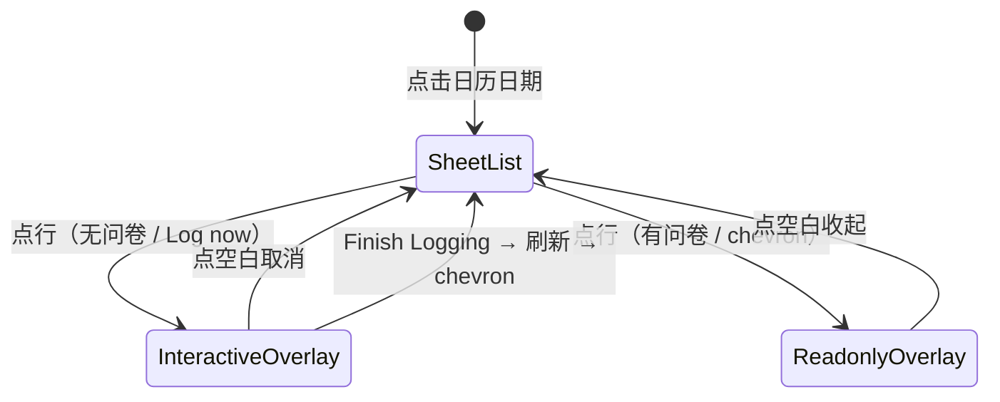
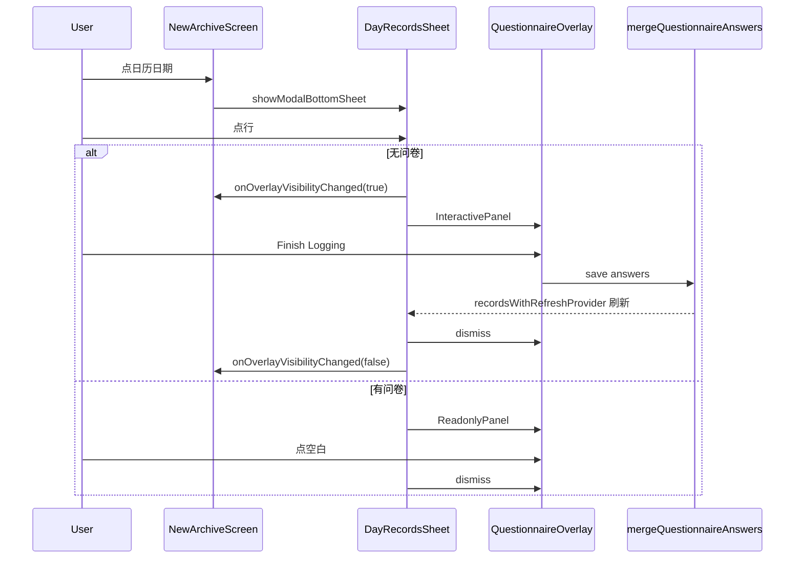

# ARCHIVE-002 Log Calendar 日期记录面板改造

**Overall Progress:** `90%`

## TLDR

改造档案页 Log Calendar 点击日期弹出的 `_DayRecordsSheet`：背景换为 Timer 页「Stop timing?」同款蓝色液体玻璃；列表行统一 SF Pro、时长改为 `x min x sec`；无问卷行尾显示 **Log now**，有问卷显示 `>`；点行分别弹出交互/只读问卷浮层（复用 `QuestionnaireOverlay` + 现有 Panel）；Finish 后刷新并切换为 `>`。抽取 `TimerBlueGlassPanel` 与 `LogNowButton` 为公共组件。

**不在范围：** 已填问卷再编辑；record 删除；Calendar 与 Logs 日导航同步；改变 Logs 页现有内联只读布局。

---

## Critical Decisions

| # | 决策 | 理由 |
|---|------|------|
| 1 | **Sheet 背景用 `_TimerBlueGlassPanel` 蓝色玻璃** | 产品指定 Stop timing 样式；顶圆角 **20** |
| 2 | **抽取 `TimerBlueGlassPanel` 到 `lib/core/widgets/`** | timer + calendar 共用；支持自定义 `borderRadius`、可选 `width`/`height` |
| 3 | **只读/交互均走 `QuestionnaireOverlay`** | 遮罩、点空白收起、单条聚焦与 Logs 浮层语义一致；避免 ListView 内嵌 scrim 指针问题 |
| 4 | **复用 `QuestionnaireReadonlyPanel` + `compact` layout** | 与 Logs 只读视觉一致；「内联」指组件复用而非文档流内嵌 |
| 5 | **无问卷：行尾 `LogNowButton` 替代 `>`** | 有问卷才显示 chevron；整行可点触发浮层 |
| 6 | **手风琴：同时仅 1 条浮层** | 打开新浮层前先 dismiss 旧浮层 |
| 7 | **Sheet 保持打开；浮层 `rootOverlay: true`** | 与 `LogsCard` 一致，避免 sheet context 层级问题 |
| 8 | **浮层期间阻塞 PageView** | `_logsOverlayVisible` 泛化为 `_archiveOverlayVisible`，Calendar + Logs 共用 |
| 9 | **Finish → 关浮层 → provider 刷新 → Log now 变 `>`** | 用户再点行展开只读问卷 |
| 10 | **写库走 `mergeQuestionnaireAnswers` + `bumpRecordsRefresh`** | 与 Logs / Timer 单一写入口一致 |
| 11 | **单日 1 条仍弹 sheet** | 删除 `_showDayRecords` 的 `length == 1` 短路 |
| 12 | **时长用 `displayMinutes` / `displaySeconds`** | 不用 `durationMinutes` + 中文；字号保持 12 |

---

## 架构

```
new_archive_screen.dart（编排）
  ├── _showDayRecords → showModalBottomSheet(DayRecordsSheet)
  ├── _archiveOverlayVisible → PageView physics 阻塞
  └── onSubmitAnswers → mergeQuestionnaireAnswers + bumpRecordsRefresh

day_records_sheet.dart（新建，ConsumerStatefulWidget）
  ├── TimerBlueGlassPanel（顶圆角 20，可变高）
  ├── 列表行：序号圆 + 时间 + 时长 + LogNowButton | chevron
  └── OverlayEntry × 2 模式
        ├── 无问卷 → QuestionnaireInteractivePanel
        └── 有问卷 → QuestionnaireReadonlyPanel

lib/core/widgets/timer_blue_glass_panel.dart（新建）
  └── 自 timer_screen._TimerBlueGlassPanel 迁出

lib/features/archive/widgets/log_now_button.dart（新建）
  └── 自 logs_card._buildLogNowButton 迁出

已有复用（不改领域逻辑）
  ├── questionnaire_overlay.dart
  ├── questionnaire_interactive_panel.dart
  ├── questionnaire_readonly_panel.dart
  ├── questionnaire_flow.dart / questionnaire_codec.dart
  ├── logs_day_utils.hasQuestionnaireAnswers
  └── session_record_utils.mergeQuestionnaireAnswers
```

### 交互状态机



### 数据流



---

## Tasks

- [x] 🟩 **Step 1: 抽取公共组件（P1）**
  - [x] 🟩 新建 `lib/core/widgets/timer_blue_glass_panel.dart`
    - [x] 🟩 迁出 `_TimerBlueGlassPanel` 样式（blur 12、蓝色渐变、白边、内层高光）
    - [x] 🟩 支持 `borderRadius`（默认四角 24；sheet 传 `BorderRadius.vertical(top: Radius.circular(20))`）
    - [x] 🟩 支持 `width` / `height` 可选（null 时由父级约束撑满）
  - [x] 🟩 `timer_screen.dart` 改引用 `TimerBlueGlassPanel`，删除私有 `_TimerBlueGlassPanel`
  - [x] 🟩 新建 `lib/features/archive/widgets/log_now_button.dart`
    - [x] 🟩 迁出 Logs 页 Log now 按钮（`#0088FF` 胶囊、SF Pro Rounded w600 17）
  - [x] 🟩 `logs_card.dart` 改引用 `LogNowButton`，删除 `_buildLogNowButton`
  - [ ] 🟨 手工回归：Timer Stop timing / Maybe Later 弹窗视觉不变

- [x] 🟩 **Step 2: 新建 DayRecordsSheet 外壳（P2）**
  - [x] 🟩 新建 `lib/features/archive/day_records_sheet.dart`
  - [x] 🟩 `ConsumerStatefulWidget`；入参 `date`、`records`、`onOverlayVisibilityChanged`、`onSubmitAnswers`
  - [x] 🟩 根布局：`TimerBlueGlassPanel` + `ConstrainedBox(maxHeight: 55% 屏高)`
  - [x] 🟩 保留：日期标题（`MMMM d, yyyy`）、`Divider`、底部 `SizedBox(20)`
  - [x] 🟩 列表行样式：
    - [x] 🟩 时间：`HH:mm`，白色，SF Pro
    - [x] 🟩 时长：`${displayMinutes} min ${displaySeconds} sec`，`white70`，12px，SF Pro
    - [x] 🟩 序号圆：`#0088FF` 背景，数字 SF Pro 白色
    - [x] 🟩 尾部：`hasQuestionnaireAnswers` ? `chevron_right` : `LogNowButton`
  - [x] 🟩 `ListView.builder` 可滚动；移除旧深色底 `#1A1A2E` 与内联 `BackdropFilter`

- [x] 🟩 **Step 3: 接入问卷浮层（P3）**
  - [x] 🟩 状态：`_overlayEntry`、`_questionnaireFlow`、`AnimationController`（finish 闪烁）、`_editingRecord`、`_isSubmitting`
  - [x] 🟩 点行逻辑（整行 `GestureDetector` / `InkWell`）：
    - [x] 🟩 有问卷 → `_openReadonlyOverlay(record)`
    - [x] 🟩 无问卷 → `_openInteractiveOverlay(record)`
  - [x] 🟩 浮层实现：
    - [x] 🟩 `Overlay.of(context, rootOverlay: true).insert(_overlayEntry)`
    - [x] 🟩 外壳 `QuestionnaireOverlay(onDismiss: _dismissOverlay)`
    - [x] 🟩 只读子组件：`QuestionnaireReadonlyPanel(answers, layout: compact)`
    - [x] 🟩 交互子组件：`QuestionnaireInteractivePanel(flow, layout: compact, onFinish: _handleFinish)`
  - [x] 🟩 打开浮层前 dismiss 已有浮层（手风琴）
  - [x] 🟩 `_handleFinish`：`encodeAnswers` → `onSubmitAnswers` → dismiss；`_isSubmitting` 防重复
  - [x] 🟩 `dispose`：移除 `_overlayEntry`、dispose flow / controller
  - [x] 🟩 `ref.watch(recordsWithRefreshProvider)` 或等价方式使 Finish 后行尾 Log now → chevron

- [x] 🟩 **Step 4: 编排层接入（P3）**
  - [x] 🟩 `new_archive_screen.dart`：`_logsOverlayVisible` → `_archiveOverlayVisible`
  - [x] 🟩 `_showDayRecords` 改动：
    - [x] 🟩 删除 `dayRecords.length == 1` 短路
    - [x] 🟩 删除 `_showRecordDetailPlaceholder` 及 SnackBar 占位
    - [x] 🟩 `showModalBottomSheet` builder 返回 `DayRecordsSheet`，传入 callbacks
  - [x] 🟩 删除 `_DayRecordsSheet` 私有类（迁至独立文件）
  - [x] 🟩 `onOverlayVisibilityChanged` → `setState(_archiveOverlayVisible)`
  - [x] 🟩 `onSubmitAnswers` → `mergeQuestionnaireAnswers` + `bumpRecordsRefresh(ref)`

- [ ] 🟨 **Step 5: 验证与收尾**
  - [ ] 🟨 手工测试清单：
    - [ ] 🟨 多日多条：sheet 蓝色玻璃、分隔线、滚动
    - [ ] 🟨 单日 1 条：仍弹 sheet
    - [ ] 🟨 无问卷：Log now → 交互浮层 → Finish → chevron 出现
    - [ ] 🟨 有问卷：chevron → 只读浮层 → 点空白收起
    - [ ] 🟨 浮层开时：PageView 不可滑；sheet 仍在底层
    - [ ] 🟨 系统返回：先关浮层，再关 sheet
    - [ ] 🟨 Timer Stop timing / Maybe Later 无回归
    - [ ] 🟨 Logs 页 Log now 无回归
  - [x] 🟩 `dart analyze` 无新增 error

---

## 关键文件索引

| 文件 | 操作 |
|------|------|
| `lib/core/widgets/timer_blue_glass_panel.dart` | 新建 |
| `lib/features/archive/widgets/log_now_button.dart` | 新建 |
| `lib/features/archive/day_records_sheet.dart` | 新建 |
| `lib/features/archive/new_archive_screen.dart` | 改：编排 + 删 `_DayRecordsSheet` |
| `lib/features/timer/timer_screen.dart` | 改：引用公共玻璃组件 |
| `lib/features/archive/logs_card.dart` | 改：引用 `LogNowButton` |

---

## 风险与回滚

| 风险 | 缓解 |
|------|------|
| sheet 内 records 过期 | `ConsumerStatefulWidget` + provider watch |
| 浮层层级错误 | 固定 `rootOverlay: true` |
| Timer 弹窗视觉回归 | P1 后立即手工点验 Stop timing / Maybe Later |
| 蓝色玻璃在全宽 sheet 上表现异常 | `TimerBlueGlassPanel` 高度由 `ConstrainedBox` + `Column` 驱动，不硬编码宽高 |

**回滚：** 还原 5 个文件；`timer_screen` 恢复内联 `_TimerBlueGlassPanel` 即可完全回退。

---

## 测试计划（手工）

1. Calendar 点有 3+ 条记录的日期 → sheet 样式、字体、时长格式正确
2. 点无问卷行 → Log now 浮层 → Finish → 行尾变 `>` → 再点只读浮层
3. 点有问卷行 → 只读浮层 → 点遮罩收起
4. 浮层打开时尝试左右滑 PageView → 应被阻塞
5. Timer / Logs 冒烟无破坏
