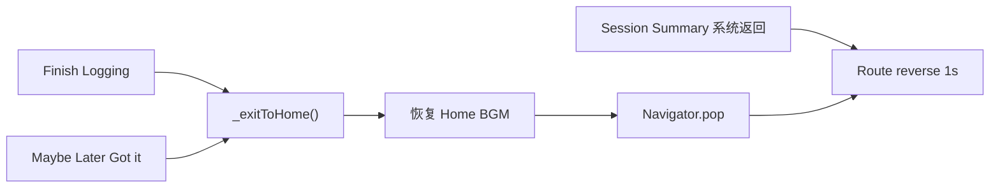

# NAV-001 Route 过渡统一 + Timer 离场改 pop

**Overall Progress:** `100%`

## TLDR

统一 Home → 三子页（Timer / Archive / Private Space）的 **Route 级** 进入/返回为 **1s easeInOut**；Timer Finish / Maybe Later **删除页内 fade**，改为与 Session Summary 系统返回一致的 **`Navigator.pop` + Route reverse**；Timer Session Summary ↔ 问卷切换 **2s → 1s**。Private stage、Audio 面板、Dialog/BottomSheet/Overlay **不在范围**。

---

## Critical Decisions

| # | 决策 | 理由 |
|---|------|------|
| 1 | **删 `_pageExitController` / `_exitToHomeWithFade`**，Finish / Maybe Later 只调 `_exitToHome()` | 与 Session Summary 系统返回一致，避免页内 fade 与 Route reverse 叠加 |
| 2 | **三子页 Route 进入/返回均 1s** | 用户拍板；Private 进入保留 fade + scale |
| 3 | **常量方案 B**：`durationPageTransitionSec = 1.0`，Home 三处引用 `animations.dart` | 单点维护，避免漏改 |
| 4 | **Archive Route 补 `Curves.easeInOut`** | 与 Timer 曲线对齐 |
| 5 | **Timer `reverseTransitionDuration` 改为 1s**（与 enter 对称） | 当前 enter 1.5s / reverse 1s 不对称 |
| 6 | **保留 `_isExiting` 门禁** | 删页内 fade 后仍防 Finish / Maybe Later 连点双 pop |
| 7 | **Private stage（820ms）、背景渐变（1450ms）、Audio 面板（500ms）不改** | 页内 UI，非 Route 级 |
| 8 | **Dialog / BottomSheet / Overlay 不改** | 维持 Material 默认或现有 overlay 行为 |
| 9 | **同步更新 `PLAN-TIMER-005.md`** | 文档与实现一致（Route reverse 1s + pop） |

---

## 架构

```
constants.dart
  durationPageTransitionSec = 1.0

animations.dart
  pageTransitionDuration  ← 引用 constants
  standardCurve = easeInOut

home_screen.dart
  _openTimer      → PageRouteBuilder fade 1s / reverse 1s / easeInOut
  _openNewArchive → PageRouteBuilder fade 1s / reverse 1s / easeInOut（补 curve）
  _openPrivateSpace → fade+scale 1s / reverse 1s / easeInOut（scale 保留）

timer_screen.dart
  删 _pageExitController、FadeTransition 包裹、_exitToHomeWithFade
  Finish / Maybe Later → _exitToHome()（保留 _isExiting）
  Session Summary ↔ 问卷 AnimatedSwitcher：2s → 1s
```

### 数据流（Timer 离场）



---

## UI 规格速查

| 元素 | 规格 |
|------|------|
| Route 进入 | 1s，`Curves.easeInOut` |
| Route 返回 | 1s，`Curves.easeInOut` |
| Timer 进入/返回 | 纯 fade |
| Archive 进入/返回 | 纯 fade（补 curve） |
| Private 进入/返回 | fade + scale 0.88→1（进入保留） |
| Timer Summary ↔ 问卷 | `AnimatedSwitcher` 1s easeInOut |
| Timer 页内 exit fade | **移除** |
| Audio 面板 | 500ms（不变） |
| Private stage 切换 | 820ms（不变） |

---

## Tasks

- [x] 🟩 **Step 1: 全局 Route 时长常量（方案 B）**
  - [x] 🟩 `constants.dart`：`durationPageTransitionSec` **1.5 → 1.0**
  - [x] 🟩 确认 `animations.dart` 的 `pageTransitionDuration` / `standardCurve` 可被 Home 引用
  - [x] 🟩 `home_screen.dart`：三处 push 改用 `pageTransitionDuration` + `standardCurve`（去掉重复 `(durationPageTransitionSec * 1000).round()`）

- [x] 🟩 **Step 2: Home 三 Route 过渡统一**
  - [x] 🟩 `_openTimer`：`transitionDuration` / `reverseTransitionDuration` 均为 **1s**；fade + easeInOut
  - [x] 🟩 `_openNewArchive`：enter/reverse **1s**；`FadeTransition` 包 `CurvedAnimation(curve: standardCurve)`
  - [x] 🟩 `_openPrivateSpace`：enter/reverse **1s**；保留 scale 0.88→1 + fade；曲线 easeInOut

- [x] 🟩 **Step 3: Timer 离场改 pop（删页内 fade）**
  - [x] 🟩 删 `_pageExitController`（init / dispose / build 中 `FadeTransition` 包裹）
  - [x] 🟩 删 `_exitToHomeWithFade()`；Finish / Maybe Later 改为直接 `await _exitToHome()`
  - [x] 🟩 **保留** `_isExiting`：在 `_exitToHome()` 内 set，防连点双 pop
  - [x] 🟩 `Log with me` 禁用条件：`_committedRecordId == null || _isExiting`

- [x] 🟩 **Step 4: Timer 页内 Summary ↔ 问卷 1s**
  - [x] 🟩 `_buildSessionPanel` 内 `AnimatedSwitcher`：`duration: 2s` → **1s**；曲线保持 easeInOut

- [x] 🟩 **Step 5: 文档 + 验证**
  - [x] 🟩 更新 `PLAN-TIMER-005.md`：离场改为 Route reverse 1s + pop；移除「整页 fade 1s / `_exitToHomeWithFade`」表述
  - [x] 🟩 `dart analyze` 改动文件无新增 error
  - [x] 🟩 手测项（代码路径已覆盖，待设备确认）

---

## 不在范围

- Private Space idle ↔ notepad ↔ history（820ms）及背景渐变（1450ms）
- Timer Audio 面板（500ms fade+scale）
- `showDialog` / `showModalBottomSheet` / Logs `QuestionnaireOverlay`
- Timer 数字↔波形（2s）、背景图切换（10s）等其它页内动画

---

## 风险与回滚

| 风险 | 缓解 |
|------|------|
| 删页内 fade 后 Finish 连点 | 保留 `_isExiting` |
| Archive 补 curve 后视觉微变 | 仅曲线，时长仍 1s |
| `constants` 改 1.0 影响未引用处 | Home 三 Route 是唯一消费者；改前 grep 确认 |

**回滚：** 恢复 `timer_screen.dart` 页内 fade + `_exitToHomeWithFade`；`constants` 改回 1.5；`home_screen.dart` 三 Route 还原各自 duration/curve。

---

## 相关文件

| 文件 | 改动 |
|------|------|
| `lib/core/constants.dart` | `durationPageTransitionSec = 1.0` |
| `lib/core/animations.dart` | 确认导出供 Home 使用（预计无逻辑改） |
| `lib/features/home/home_screen.dart` | 三 Route 统一 1s + 引用 animations |
| `lib/features/timer/timer_screen.dart` | 删页内 exit fade；Summary↔问卷 1s；保留 `_isExiting` |
| `.cursor/plans/PLAN-TIMER-005.md` | 同步离场描述 |
