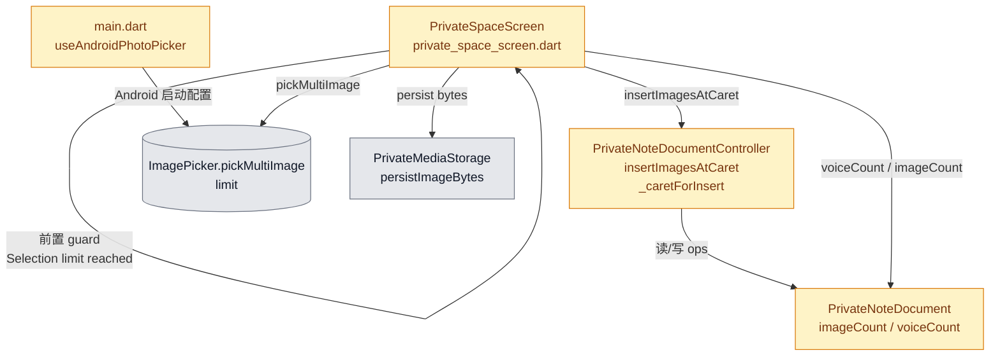
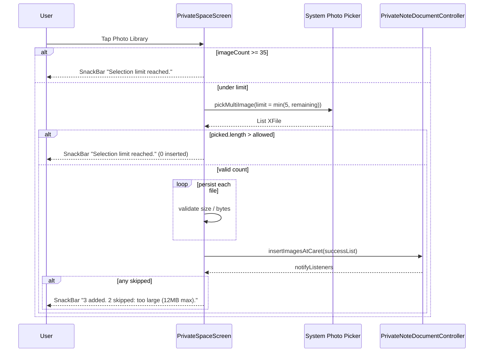

# PLAN-PS-GALLERY-001: Private Space 图库多选上限 & Embed 插入顺序

**Overall Progress:** `100%`

## TLDR

修复 Private Space 笔记从图库批量选图的三个问题：**单次最多 5 张**（系统 picker + 应用层兜底）、**单笔记图片/录音各最多 35 条**（达上限前置拦截）、**多图按光标后顺序插入**（修复 `_caretForInsert` 连续插入错位）。批量导入一次 undo；文件校验失败时部分插入并说明 skip 原因。

---

## 最终规格（探索已确认）

| 项 | 行为 |

|----|------|

| 单次图库选择 | `limit = min(5, 35 - 当前图片数)`；系统 picker 原生封锁 |

| 单笔记图片上限 | **35**（现 30，需改） |

| 单笔记录音上限 | **35**（现无限制，需新增） |

| 达上限前置拦截 | 点「插入图片 / 录音」**立即** SnackBar，不打开 picker / 录音 sheet |

| 选图返回超限 | **整批拒绝**，0 插入 |

| 限额类 SnackBar | 统一 `"Selection limit reached."` |

| 文件校验失败 | 可导入的照常插入；SnackBar **说明 skip 原因**（过大 / 不可用 / 保存失败等） |

| 插入位置 | 严格在**当前光标之后**；光标在已有 embed 前 → 新内容插在该 embed **之前** |

| 多图顺序 | 与用户在 picker 中的选择顺序一致，自上而下排列 |

| 批量 undo | 一次选图成功导入 = **一条** undo 记录 |

| 平台 | Android 主测；iOS 同步传 `limit`；Android 需 `useAndroidPhotoPicker` |

| 不在范围 | 自定义选图 UI、粘贴图片、拖拽排序 |

---

## Critical Decisions

> **范式：** 从问题本质出发——限额是**入口守卫 + 返回值校验**两层；顺序问题是**光标状态在批量插入间丢失**；undo 问题是**每条 insert 各记一次 snapshot**。最简解：修一处 caret 逻辑 + 一个批量 API + 前置 guard，不引入新模块。

| # | 决策 | 第一性原理依据 |

|---|------|----------------|

| 1 | **`insertImagesAtCaret(List)` 批量 API**，单次 `_recordHistorySnapshot()` | undo 语义 = 一次用户操作；循环调 `insertImageAtCaret` 会产生 N 次 undo，违背 Q7 |

| 2 | **修 `_caretForInsert()`**：`isCaretOnEmbed && _caret.textOffset == 1` 时以 `_caret` 为基准，插入点在其后 | 根因是第二轮插入回读 TextField 旧位置；用已更新的 semantic caret 比再加一层 wrapper 更少活动部件 |

| 3 | **限额常量 + 前置 guard 集中在 `private_space_screen.dart`** | 选图/录音入口本就在此；`imageCount`/`voiceCount` 只读 document，不新建 service |

| 4 | **`voiceCount` 加到 `PrivateNoteDocument`**（与 `imageCount` 对称） | 计数逻辑属于 document 模型；controller 暴露 getter，避免 screen 内手写遍历 |

| 5 | **系统 picker + 应用层 `picked.length > allowed` 整批拒绝** | `limit` 在 Android 12− / 部分设备不可靠；双层保证正确性，不建自定义 picker |

| 6 | **Android Photo Picker 在 `main.dart` 一次性配置** | 全局插件配置属 bootstrap 职责；与业务 screen 解耦 |

| 7 | **Skip 原因用小型 enum + 汇总 SnackBar**，与 `"Selection limit reached."` 分离 | 限额 vs 文件校验是不同失败类型；合并文案会丢失「过大 / 不可用」信息 |

| 8 | **执行顺序：常量 & guard → caret 修复 & 批量 API → screen 接线 → 测试** | guard 可独立验证；批量 API 依赖 caret 修复；测试覆盖最后两步 |

---

## Architecture

**执行顺序依据：** Step 1 无依赖、风险低（上限从 30→35 易漏测）；Step 2 是顺序 bug 根因，必须在 Step 3 批量导入前完成；Step 3 串联 picker + 持久化 + snackbar；Step 4 测试锁定回归。

### 模块关系图

- **Screen**：入口 guard、picker 调用、持久化、SnackBar

- **Controller**：caret 语义 + 批量插入 + 单次 history

- **Document**：embed 计数

### 选图交互序列

---

## Tasks

- [x] 🟩 **Step 1: 常量、计数与 Android Picker 配置**

  - [x] 🟩 1a. `PrivateNoteDocument` 新增 `voiceCount` getter

  - [x] 🟩 1b. `PrivateNoteDocumentController` 暴露 `voiceCount` getter

  - [x] 🟩 1c. `private_space_screen.dart`：`_maxImagesPerNote = 35`、`_maxVoicesPerNote = 35`、`_maxGalleryPickCount = 5`、`_kSelectionLimitReached = 'Selection limit reached.'`

  - [x] 🟩 1d. `main.dart`：Android 启动时 `ImagePickerAndroid.useAndroidPhotoPicker = true`

- [x] 🟩 **Step 2: Caret 修复与批量插入 API**

  - [x] 🟩 2a. 修 `_caretForInsert()`：embed 右侧（`textOffset == 1`）时返回「当前 embed 之后」插入点，不再回退读 TextField 旧 offset

  - [x] 🟩 2b. 新增 `insertImagesAtCaret(List<PrivateImageData> images)`：开头一次 `_recordHistorySnapshot()`，按序循环 `_insertOpAtCaret`，末尾一次 `_bindTextControllers` + `notifyListeners`

  - [x] 🟩 2c. 保留 `insertImageAtCaret` 单张路径（相机 / 粘贴），内部委托 `insertImagesAtCaret([image])`

- [x] 🟩 **Step 3: Screen 入口 guard、选图流程与 SnackBar**

  - [x] 🟩 3a. `_pickImage()`：`imageCount >= 35` → 立即 SnackBar，不弹 action sheet

  - [x] 🟩 3b. `_addVoiceBlock()`：`voiceCount >= 35` → 立即 SnackBar，不打开 `PrivateVoiceRecordSheet`

  - [x] 🟩 3c. `_pickGalleryImages()`：`pickLimit = min(5, 35 - imageCount)`；返回后 `picked.length > pickLimit` → 整批拒绝

  - [x] 🟩 3d. 持久化阶段收集成功/失败；成功列表调 `insertImagesAtCaret`；失败按原因分类

  - [x] 🟩 3e. Skip 汇总 SnackBar（带 too large / unavailable / save failed 原因）

  - [x] 🟩 3f. 相机单张路径：达 35 已在 3a 拦截；34 张时仍可拍 1 张

- [x] 🟩 **Step 4: 自动化测试**

  - [x] 🟩 4a. `private_note_document_controller_test.dart`：文本中间连续插 3 图 → ops 顺序正确

  - [x] 🟩 4b. 同上：批量 `insertImagesAtCaret` 一次 undo 恢复全部

  - [x] 🟩 4c. `test/private_note_gallery_import_test.dart`：`galleryPickLimit` / `shouldRejectGalleryBatch`

---

## 详细改动清单

### 1. Bootstrap

| 位置 | 改前 | 改后 | 文件 |

|------|------|------|------|

| Android Photo Picker | 无配置 | `_configureImagePicker()` 设 `useAndroidPhotoPicker = true` | `lib/main.dart` |

| 依赖 | 仅 `image_picker` | 增加 `image_picker_android`、`image_picker_platform_interface` | `pubspec.yaml` |

### 2. Document 模型

| 位置 | 改前 | 改后 | 文件 |

|------|------|------|------|

| embed 计数 | 仅 `imageCount` | 新增 `voiceCount` | `lib/models/private_note_document.dart` |

| controller getter | 仅 `imageCount` | 新增 `voiceCount` | `lib/features/private_space/private_note_document_controller.dart` |

### 3. Controller — caret & 批量插入

| 位置 | 改动 | 文件 |

|------|------|------|

| `_caretForInsert()` | embed 右侧优先返回其后插入点 | `private_note_document_controller.dart` |

| `insertImagesAtCaret(List)` | 新增批量 API，单次 undo | 同上 |

| `insertImageAtCaret` | 委托 `insertImagesAtCaret([image])` | 同上 |

### 4. Screen — 限额 & 选图

| 位置 | 改动 | 文件 |

|------|------|------|

| 常量 / guard / picker / snackbar | 见 Step 3 | `private_space_screen.dart` |

| pickLimit 纯函数 | 新增 `private_note_gallery_limits.dart` | `lib/features/private_space/private_note_gallery_limits.dart` |

### 5. 自动化测试

| 测试文件 | 断言/覆盖 |

|----------|-----------|

| `test/private_note_document_controller_test.dart` | 中间文本 3 图顺序 + 批量 undo |

| `test/private_note_gallery_import_test.dart` | pickLimit / reject batch |

---

## 手动测试清单（供你逐项勾选）

### A. 前置拦截（35 上限）

- [ ] **A1** 笔记已有 35 张图 → 点插入图片 → 立即 `"Selection limit reached."`，不出现 Photo Library / Camera sheet

- [ ] **A2** 笔记已有 35 条录音 → 点插入录音 → 立即 `"Selection limit reached."`，不出现录音 sheet

- [ ] **A3** 笔记 34 张图 → 相机可拍 1 张并成功插入

### B. 单次选图上限（5 张）

- [ ] **B1** 空笔记 → Photo Library 最多选 5 张（系统 UI 封锁第 6 张）

- [ ] **B2** 若系统返回 >5（模拟/低版本 Android）→ 0 插入 + `"Selection limit reached."`

- [ ] **B3** 笔记已有 33 张 → picker 最多选 2 张；若返回 3 张 → 整批拒绝 + `"Selection limit reached."`

### C. 插入顺序

- [ ] **C1** 文本 `hello world`，光标在 `hello|` 后 → 选 3 张 → 顺序 img1、img2、img3，文本拆为 `hello` + 三图 + ` world`

- [ ] **C2** 光标在已有图片**前** → 新图插在该图之前（与光标位置一致）

- [ ] **C3** 插入录音 → 出现在光标后（与图片规则一致）

### D. 部分失败 & SnackBar

- [ ] **D1** 选 5 张，其中超大图 → 其余插入 + SnackBar 含 `too large (12MB max)` 及 skipped 数量

- [ ] **D2** 5 张全部不可用 → 0 插入 + SnackBar 说明原因（非 `"Selection limit reached."`）

### E. Undo

- [ ] **E1** 一次导入 5 张成功 → 单次 undo 移除全部 5 张

- [ ] **E2** 导入 3 成功 / 2 skip → undo 一次移除 3 张

### F. 回归

- [ ] **F1** 单张相机插入仍正常

- [ ] **F2** 粘贴图片 / 复制 cut 图片不受影响

- [ ] **F3** 引导词 dismiss（插图仍触发 placeholder 消失）

---

## 风险 / 备注

- **Picker 内 SnackBar 不可行**：选满后封锁依赖系统 UI；App 内 `"Selection limit reached."` 在返回后或入口 guard 展示

- **Android 12−**：`limit` 可能无效，**必须**保留应用层 `picked.length` 校验

- **`_caretForInsert` 改动** 影响 `insertVoiceAtCaret` / 粘贴图，需跑全量 private note controller 测试

- **`private_note_blocks.dart` 的 `_maxImages = 1`** 为历史列表缩略图展示，与笔记 35 上限无关，**不改**

---

## 测试记录

| 日期 | 设备/系统 | 测试人 | 通过项 | 问题摘要 |

|------|-----------|--------|--------|----------|

| 2026-06-17 | Windows / flutter test | Cursor | 自动化 59/59 通过 | 待 Android 真机手动验证 |

