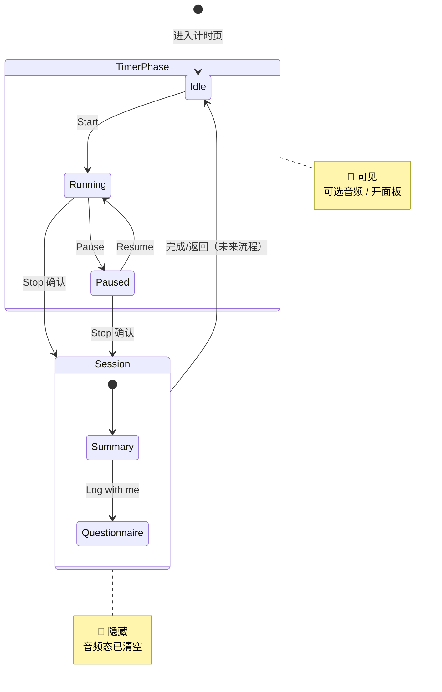

# TIMER-001 音乐按钮 + 音频面板实施计划

**Overall Progress:** `100%`

## TLDR

在计时页（idle / running / paused）新增音乐按钮与液体玻璃音频选择面板。采用**三层架构**：全局 `LiquidGlassBackground`（展示）→ `audio_picker.dart`（UI 组件）→ `TimerScreen`（状态编排）。进入 session 时清空音频选中态。本期不接 `audio_provider`。

---

## 架构评估结论

### 为何不用单文件（方案 A）

`timer_screen.dart` 已 **1796 行**，承载计时、波形、session 面板、问卷状态机。再塞 ~250 行 UI 会提高回归成本，且 TIMER-002 接播放时改动面过大。

### 为何不用 Riverpod（方案 C）

本期无真实播放、无跨页面共享；`TimerScreen` 已是 `StatefulWidget + TickerProviderStateMixin`。引入 provider 增加样板代码，收益为零。

### 最终架构：方案 B+（3 文件、职责单一）

| 层级 | 文件 | 职责 | 持有 state |
|------|------|------|------------|
| Core 展示 | `lib/core/widgets/liquid_glass_background.dart` | 三层 blur 参数，零业务 | 否 |
| Feature UI | `lib/features/timer/widgets/audio_picker.dart` | 按钮、面板、列表项渲染 | 否（纯 props + 回调） |
| Feature 编排 | `lib/features/timer/timer_screen.dart` | 可见性、选中态、动画 controller、scrim 时机、session 清理 | 是 |

**第一性原理：** UI 组件只接收「显示什么」和「用户点了什么」；「意味着什么」由父级决定。TIMER-002 只在父级 `_onAudioItemTap` 内加一行调用 `audio_provider`，不动 widget 文件。

### 与代码库现状对齐

- `lib/core/` 已有 `constants.dart`、`theme.dart`，新增 `widgets/` 子目录合理；archive 的液体玻璃参数不同（blur 1 / 白 35%），**本期不迁移**，避免视觉回归
- `timer/` 目录目前仅 `timer_screen.dart`，新增 `widgets/` 为 feature 内聚，不污染全局
- session 面板液体玻璃参数与 timer 问卷一致，**必须**改用全局 `LiquidGlassBackground`

---

## Critical Decisions（全部已确认）

| # | 决策 | 内容 |
|---|------|------|
| 1 | 文件结构 | 3 文件：core widget + audio_picker + timer_screen |
| 2 | 液体玻璃 | 全局 `LiquidGlassBackground`；timer session + 音频面板使用；archive 后续迁移 |
| 3 | 按钮可见性 | 仅 `!_showSessionPanel`（idle / running / paused）；session 后隐藏 |
| 4 | 面板交互 | scrim 锁屏；点空白关闭；🎵 只负责打开 |
| 5 | 选中态 | 父级 `_selectedAudioIndex`（`int?`）；`0`=No Audio，`1–11`=曲目 |
| 6 | 旋转 | `selected != null && != 0` 时 3s/圈匀速；否则 stop |
| 7 | Session 清理 | 进入 session 时：**关面板 + 清空选中 + 停旋转**（用户选 B） |
| 8 | TIMER-002 | 父级保管选中索引；`audio_provider` 仅作播放引擎 |

---

## 文件与公开 API 契约

### 1. `lib/core/widgets/liquid_glass_background.dart`

```dart
/// 计时页问卷 / 音频面板同款三层液体玻璃。无参数、无 state。
class LiquidGlassBackground extends StatelessWidget {
  const LiquidGlassBackground({super.key});
  @override
  Widget build(BuildContext context) => /* 自 timer_screen L841–874 原样提取 */;
}
```

### 2. `lib/features/timer/widgets/audio_picker.dart`

```dart
/// 音频曲目常量（顺序不可变，index 即业务 ID）
const kTimerAudioTracks = <String>[
  'No Audio',
  'Guided Belly Breathing - Female',
  // ... 共 12 条
];

/// 33×33 音乐按钮，旋转由父级 controller 驱动
class TimerMusicButton extends StatelessWidget {
  const TimerMusicButton({
    super.key,
    required this.rotationAnimation,
    required this.onTap,
  });
  final Animation<double> rotationAnimation;
  final VoidCallback onTap;
}

/// 全屏 scrim + 定位面板（含展开动效）
class AudioPickerLayer extends StatelessWidget {
  const AudioPickerLayer({
    super.key,
    required this.isOpen,
    required this.panelAnimation,
    required this.selectedIndex,
    required this.onClose,
    required this.onSelect,
    required this.screenSize,
  });
  final bool isOpen;
  final Animation<double> panelAnimation;
  final int? selectedIndex;
  final VoidCallback onClose;
  final ValueChanged<int> onSelect;
  final Size screenSize;
}
```

**`AudioPickerLayer` 内部结构：**

```
Stack
├── [if isOpen] Positioned.fill → GestureDetector(scrim, onTap: onClose)
└── [if isOpen] Positioned(top/width/height 按 Figma) → FadeTransition × ScaleTransition
    └── Stack
        ├── LiquidGlassBackground()
        └── Padding(top: sy(26)) → 标题 + ListView/List.generate(12 条)
            └── _AudioTrackTile(selected, onTap)
```

**`_AudioTrackTile`（private）：** 高亮逻辑对齐问卷 L744–766，字号 14；`RichText` 或 `Text.rich` 实现 `· ` w700 + 名称 w400。

### 3. `lib/features/timer/timer_screen.dart`（编排层新增）

**State 字段：**

```dart
bool _showAudioPanel = false;
int? _selectedAudioIndex;          // null | 0..11
late final AnimationController _audioRotationController;  // 3s, repeat
late final AnimationController _audioPanelController;   // 1s, forward/reverse
```

**核心方法：**

| 方法 | 职责 |
|------|------|
| `_openAudioPanel()` | `_showAudioPanel=true` + `_audioPanelController.forward()` |
| `_closeAudioPanel()` | `_audioPanelController.reverse()` → `then` 设 `_showAudioPanel=false` |
| `_onAudioItemTap(int index)` | 同条取消 / 新条选中 → `_syncAudioRotation()` + `// TODO: TIMER-002` |
| `_syncAudioRotation()` | 非 null 且 ≠0 → `repeat()`；否则 `stop()` |
| `_resetAudioOnSessionEnter()` | `_closeAudioPanel()` + `_selectedAudioIndex=null` + `_syncAudioRotation()` |
| `_buildActionRow()` | 主按钮 + `SizedBox(8)` + `TimerMusicButton` |

**`_doStopTimer` 改动（L1508 setState 块内追加）：**

```dart
_showSessionPanel = true;
_resetAudioOnSessionEnter();  // 关面板、清空选中、停旋转
```

---

## 渲染层序（`build()` 根 Stack）

```
Scaffold.body Stack
├── 背景图（tap 切换，音频面板打开时被 scrim 挡住）
├── 云朵动画
├── if (!_showSessionPanel)
│   ├── SafeArea → _buildTimerLayout（仅计时显示，不含操作区）
│   ├── if (_showAudioPanel) AudioPickerLayer(...)
│   └── Positioned(bottom:88) → Center(_buildActionRow())
└── if (_showSessionPanel) _buildSessionPanel
    └── 内含 LiquidGlassBackground()（替换原内联三层）
```

**互斥保证：** `_showSessionPanel` 与 `_showAudioPanel` 永不同时为 true（session 进入时强制 reset）。

---

## 状态机



**音频选中子状态（仅在 TimerPhase 有效）：**

| `_selectedAudioIndex` | 高亮 | 旋转 |
|-----------------------|------|------|
| `null` | 无 | 停 |
| `0` (No Audio) | 有 | 停 |
| `1–11` | 有 | 转 |

---

## UI 规格速查

| 元素 | 参数 |
|------|------|
| 音乐按钮 | 33×33，`#F7F7F7`，阴影 `0x1E000000` blur40 offset(0,8)，🎵 19px `#0088FF` w600 |
| 按钮位置 | 主操作按钮右侧 `SizedBox(width: 8)` |
| 面板 top/height/width | `h×228/852` / `h×414/852` / `w×289/393`，水平居中 |
| 面板动效 | 1s `easeInOut`，Fade 0→1 + Scale 0.96→1 |
| Scrim | 全屏半透明黑（建议 `Colors.black.withOpacity(0.25)`，实现时可微调，必须有锁屏效果） |
| 内容区 | 顶距 `sy(26)`，宽 `sx(255)` 居中 |
| 标题 | `Choose an audio you like:\n\n`，Josefin Sans 16 w500 白 |
| 列表 | 12 条，`· ` SF Pro 14 w700 + 名 w400；选中 `#0088FF` 底 radius8 |

**Figma 缩放（与 session 面板一致）：**

```dart
final xScale = screenSize.width / 393;
final yScale = screenSize.height / 852;
double sx(double v) => v * xScale;
double sy(double v) => v * yScale;
```

在 `AudioPickerLayer` 内从 `screenSize` 计算，不抽公共类（本期 scope）。

---

## 分步执行（审核后按序实施）

- [x] 🟩 **Phase 1: 全局液体玻璃**
  - [x] 🟩 新建 `lib/core/widgets/liquid_glass_background.dart`
  - [x] 🟩 `timer_screen.dart` session 面板 L841–874 替换为 `const LiquidGlassBackground()`
  - [x] 🟩 代码对比验证：视觉参数与原实现一致（待你本地热重载确认）

- [x] 🟩 **Phase 2: audio_picker 组件（无接入）**
  - [x] 🟩 新建 `lib/features/timer/widgets/audio_picker.dart`
  - [x] 🟩 实现 `kTimerAudioTracks`（12 条）
  - [x] 🟩 实现 `TimerMusicButton`（样式 + `RotationTransition`）
  - [x] 🟩 实现 `AudioPickerLayer` + `_AudioTrackTile`（玻璃 + 列表 + 高亮）
  - [x] 🟩 组件独立 analyze 通过

- [x] 🟩 **Phase 3: TimerScreen 状态与编排**
  - [x] 🟩 新增 state 字段 + 两个 AnimationController（init/dispose）
  - [x] 🟩 实现 `_open/_close/_onAudioItemTap/_syncAudioRotation/_resetAudioOnSessionEnter`
  - [x] 🟩 `_doStopTimer` 调用 `_resetAudioOnSessionEnter`
  - [x] 🟩 `_startTimer` 不清理音频态（计时中保留选择）

- [x] 🟩 **Phase 4: 布局接入**
  - [x] 🟩 实现 `_buildActionRow()`（idle / running / paused 三态）
  - [x] 🟩 从 `_buildTimerLayout` 移除 `bottom:88` 操作区
  - [x] 🟩 根 Stack `if (!_showSessionPanel)` 分支接入 `AudioPickerLayer` + `_buildActionRow`
  - [x] 🟩 验证 running 宽度 301/393 不溢出（静态宽度核算）

- [x] 🟩 **Phase 5: 验证与收尾**
  - [x] 🟩 `flutter analyze`：新增文件无问题；`timer_screen.dart` 仅既有 info 级提示
  - [x] 🟩 执行 Test Plan（代码审查 + 真机反馈修复，见下）
  - [x] 🟩 更新本 plan 进度百分比

---

## Test Plan（2026-06-06 验收记录）

| # | 用例 | 状态 | 说明 |
|---|------|------|------|
| 1 | idle：Start 旁有 🎵 | 🟩 通过 | TIMER-002 后间距 **16px**，真机确认 |
| 2 | running：Pause + Stop + 🎵 不溢出 | 🟩 通过 | 真机 + 静态宽度 309/393 |
| 3 | paused：Resume + 🎵 可见 | 🟩 通过 | 真机确认 |
| 4 | 点 🎵 展开；scrim 锁屏 | 🟩 通过 | 层序修复后真机复验通过 |
| 5 | 点空白关闭；选中态保留 | 🟩 通过 | 真机确认 |
| 6 | 选曲目高亮 + 旋转；再点取消 | 🟩 通过 | 真机确认 |
| 7 | 选 No Audio 高亮 + 停转 | 🟩 通过 | 真机确认 |
| 8 | A→B 切换旋转不中断 | 🟩 通过 | 真机确认 |
| 9 | Stop 进 session 清理 | 🟩 通过 | 真机确认 |
| 10 | session 玻璃背景一致 | 🟩 通过 | 真机确认 |

### 真机验收已修复项（本轮）

1. **scrim 未锁住操作区** — `AudioPickerLayer` 移至 `_buildActionRow` **之后**渲染，全屏遮罩盖住底部按钮
2. **面板动效过快/过慢** — `_audioPanelController` duration：`1s` → **`500ms`**（按产品要求）

### 待修复 / 改善（汇总）

| 优先级 | 项 | 状态 |
|--------|-----|------|
| P0 | scrim 锁屏失效 | ✅ 已修复（层序调整） |
| P1 | 面板动效 0.5s | ✅ 已修复 |
| P2 | 真机复验 Test Plan 剩余 7 项 | ✅ 已全部通过（2026-06-06） |
| P3 | PLAN 文档中「8px 间距」「1s 动效」描述过时 | ✅ 已同步为 16px / 0.5s |

---

## TIMER-002 扩展点（本期不实现）

在 `_onAudioItemTap` 内：

```dart
// TODO: TIMER-002
// if (newIndex != null && newIndex != 0) {
//   ref.read(audioPlayerProvider).play(kTimerAudioTrackAssets[newIndex]);
// } else {
//   ref.read(audioPlayerProvider).stop();
// }
```

父级继续保管 `_selectedAudioIndex`；asset 路径表可放在 `timer_audio_constants.dart`（TIMER-002 再建）。

---

## 不在本期范围

- `audio_provider` 真实播放
- archive / private_space 液体玻璃迁移
- `timer_screen.dart` 问卷逻辑拆分
- Widget test

---

## 风险与缓解

| 风险 | 缓解 |
|------|------|
| `BackdropFilter` 性能 | session 与 audio 面板互斥；不同时渲染 |
| scrim 与 Dialog 冲突 | Stop 确认 Dialog 关闭后才进 session；音频面板与 Dialog 不共存 |
| `reverse()` 动画未完成即切 session | `_resetAudioOnSessionEnter` 同步设 `_showAudioPanel=false` 并 `controller.reset()` |

---

## 回滚方案

1. 删除 `lib/core/widgets/liquid_glass_background.dart`
2. 删除 `lib/features/timer/widgets/audio_picker.dart`
3. `git checkout` 还原 `timer_screen.dart`

---

## 变更文件清单

| 文件 | 操作 |
|------|------|
| `lib/core/widgets/liquid_glass_background.dart` | 新建 |
| `lib/features/timer/widgets/audio_picker.dart` | 新建 |
| `lib/features/timer/timer_screen.dart` | 修改 |
| `.cursor/issues/TIMER-001-*.md` | 已同步 |
| `.cursor/plans/PLAN-TIMER-001.md` | 本文档 |
