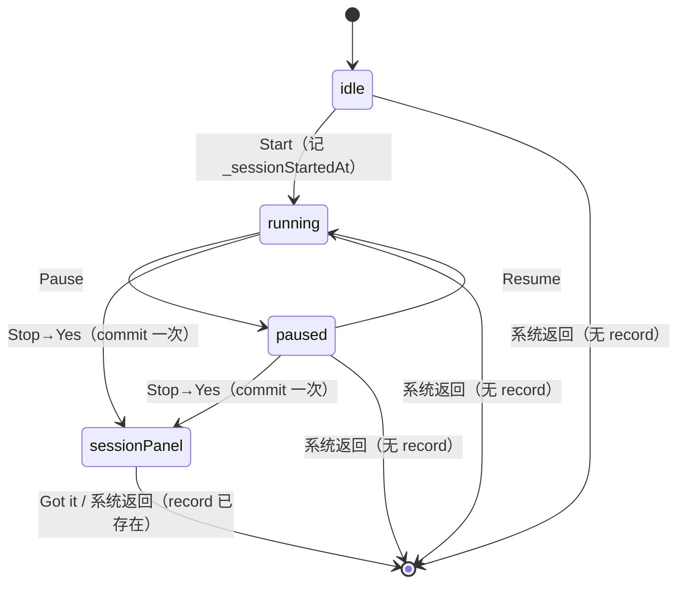

# TIMER-004 Session 落库 + Maybe Later 弹窗实施计划

**Overall Progress:** `100%`

## TLDR

Stop 确认进入 session 面板时，**幂等写入**一条 `BowelRecord`（`durationSeconds`、`dateTime`=Start 时刻、问卷 `null`），Log Calendar 展示真实数据；Session Summary 接三项统计；`Maybe Later` 弹窗 + `Got it(Back to Home)` 回星空页并 resume BGM。计时前/中系统返回废弃、不写库；session 内返回保留 record。

**不在范围：** 问卷 merge、`>>Finish Logging` 落库、record 删除 UI。

---

## Critical Decisions

| #   | 决策                                                   | 理由                                                                            |
| --- | ------------------------------------------------------ | ------------------------------------------------------------------------------- |
| 1   | **单次落库点** `_doStopTimer`                          | 进入 session = 已提交；导航/弹窗不碰数据                                        |
| 2   | **新建** `session_record_utils.dart`（纯函数）         | `timer_screen.dart` 已 1879 行；commit + stats 可测、无 UI 耦合                 |
| 3   | **`durationSeconds` 为唯一时长源**                     | UI 拆 min+sec；`durationMinutes` 写入时派生 `~/ 60` 兼容旧消费者                |
| 4   | **幂等锁** `_committedRecordId`                        | 防重复 `saveRecord`；新 session 在 `_startTimer` 清空                           |
| 5   | **统计缓存** `_summaryStats`                           | `save` 后算一次，Summary build 直读，避免每帧扫 Hive                            |
| 6   | **刷新** `bumpRecordsRefresh(ref)`                     | 复用现有 `recordsRefreshProvider`，不改 `LocalStorage` API                      |
| 7   | **退出单入口** `_exitToHome()`                         | Got it / session 内 PopScope 共用；`homeMusicEnabledProvider` 为真时 `resume()` |
| 8   | **不接 `timerProvider`**                               | 未接线死代码，避免双状态源                                                      |
| 9   | **弹窗** `_MaybeLaterDialog` 私有 widget               | 复制 `_StopConfirmDialog` 玻璃壳，本 ticket 不抽公共组件、不改 Stop 弹窗        |
| 10  | **周边界** `MaterialLocalizations.firstDayOfWeekIndex` | 跟系统 locale 一周首日                                                          |
| 11  | **零时长** 仍 commit                                   | `durationSeconds: 0`；删除由用户日后在 Calendar 操作                            |
| 12  | **Time since last log** 无历史上一条 → 显示 `0`        | 实现口径统一，避免 UI `—` / `0` 混用                                            |

---

## 架构

```
timer_screen.dart（编排）
  ├── _sessionStartedAt / _committedRecordId / _summaryStats
  ├── _doStopTimer → commit + stats + bumpRefresh
  ├── _exitToHome → resume BGM + Navigator.pop
  ├── PopScope（session 内外分流）
  └── _MaybeLaterDialog

session_record_utils.dart（领域，新建）
  ├── commitTimerSession()
  ├── computeSummaryStats()
  └── weekRangeForLocale()  // 内部 helper

bowel_record.dart（模型）
  └── durationSeconds + fromTimerSession() + display getters

records_provider.dart
  └── 去 mock + bumpRecordsRefresh()
```

### Session 状态机



---

## Tasks

- [x] 🟩 **Step 1: 模型层 `BowelRecord`**
  - [x] 🟩 新增字段 `durationSeconds`（`final int`，默认 `0`）
  - [x] 🟩 `fromJson`：有 `duration_seconds` 用之；否则 `durationMinutes * 60`
  - [x] 🟩 `toJson`：写入 `duration_seconds`；同步写 `duration_minutes: durationSeconds ~/ 60`
  - [x] 🟩 工厂 `BowelRecord.fromTimerSession({required DateTime startedAt, required Duration elapsed})`：`id`=uuid、`dateTime`=startedAt、`questionnaireAnswers`=null
  - [x] 🟩 展示 getter：`displayMinutes` / `displaySeconds`（`durationSeconds ~/ 60` / `% 60`）
  - [x] 🟩 `copyWith` 补 `durationSeconds`

- [x] 🟩 **Step 2: 领域层 `session_record_utils.dart`（新建）**
  - [x] 🟩 `SessionSummaryStats` 数据类：`todayCount`、`hoursSinceLastLog`（`double` 或整小时）、`weekCount`
  - [x] 🟩 `Future<BowelRecord> commitTimerSession({required DateTime startedAt, required Duration elapsed})` → `BowelRecord.fromTimerSession` + `LocalStorage.saveRecord`
  - [x] 🟩 `SessionSummaryStats computeSummaryStats({required List<BowelRecord> all, required String currentRecordId, required int firstDayOfWeekIndex, required DateTime now})`
    - [x] 🟩 Today：本地日 `dateTime` 与 `now` 同日，**含 current**
    - [x] 🟩 Since last：按 `dateTime` 倒序，current 之后第一条更旧 record，小时差 `floor`；无 → `0`
    - [x] 🟩 Week：locale 周界 `[weekStart, weekEnd]` 内 count，**含 current**
  - [x] 🟩 周界 helper：由 `firstDayOfWeekIndex` + `now` 算 `weekStart`（本地午夜对齐）

- [x] 🟩 **Step 3: Provider 去 mock + 刷新**
  - [x] 🟩 删除 `records_provider.dart` 中 `_generateMockRecords` 及两处 mock 回退
  - [x] 🟩 `recordsWithRefreshProvider` / `recordsInRangeProvider` 仅返回 `LocalStorage` 真实数据
  - [x] 🟩 新增 `void bumpRecordsRefresh(WidgetRef ref)`（`recordsRefreshProvider++`）
  - [x] 🟩 `chart_analysis_card.dart`：`_effectiveRecords` 改 `widget.records`（删除内部 mock 强制），空列表走现有空态/零值展示
  - [x] 🟩 `new_archive_screen.dart`：日历页 `records.isEmpty` 时展示空态文案（非 loading 假数据）

- [x] 🟩 **Step 4: Timer 落库编排**
  - [x] 🟩 `timer_screen.dart` 新增状态：`_sessionStartedAt`、`_committedRecordId`、`_summaryStats`
  - [x] 🟩 `_startTimer`：设 `_sessionStartedAt = DateTime.now()`；清空 `_committedRecordId`、`_summaryStats`
  - [x] 🟩 `_doStopTimer` 内（`setState` 前/后 async 注意 mounted）：
    - [x] 🟩 若 `_committedRecordId == null` 且 `_sessionStartedAt != null`：调用 `commitTimerSession`
    - [x] 🟩 读 `LocalStorage.getAllRecords()` + `computeSummaryStats`（`firstDayOfWeekIndex` 从 `MaterialLocalizations.of(context)`）
    - [x] 🟩 赋值 `_committedRecordId`、`_summaryStats`；`bumpRecordsRefresh(ref)`
    - [x] 🟩 0:00 时长同样执行（`elapsed.inSeconds == 0` 合法）
  - [x] 🟩 Summary Duration 行：优先 `_lastSessionDuration` 或 committed record 的 `displayMinutes/Seconds`（保持一致）

- [x] 🟩 **Step 5: Session Summary UI 接真实统计**
  - [x] 🟩 替换 `Today's Log: #x` → `_summaryStats.todayCount`
  - [x] 🟩 替换 `Time since last log: x hrs` → `_summaryStats.hoursSinceLastLog`（格式如 `3 hrs` 或 `0 hrs`）
  - [x] 🟩 替换 `Total logs this week: x` → `_summaryStats.weekCount`
  - [x] 🟩 `_summaryStats == null` 时 fallback（不应出现于正常 Stop 路径，可 assert 或显示 `—`）

- [x] 🟩 **Step 6: 返回分流 + BGM resume**
  - [x] 🟩 实现 `_exitToHome()`：`homeMusicEnabledProvider == true` → `resume()`；`Navigator.pop(context)`
  - [x] 🟩 `Scaffold`/`build` 外包 `PopScope`：
    - [x] 🟩 `!_showSessionPanel`：直接 pop（废弃计时，无 commit）
    - [x] 🟩 `_showSessionPanel`：`onPopInvokedWithResult` 中 `didPop` 时恢复 Home BGM（record 已在 Step 4 写入，**不 delete**）
  - [x] 🟩 验证：计时中 Android 返回 / iOS 侧滑 → Hive 无新 record

- [x] 🟩 **Step 7: Maybe Later 弹窗**
  - [x] 🟩 `Maybe Later` `Text` 外包 `GestureDetector` → `_showMaybeLaterDialog()`
  - [x] 🟩 新建 `_MaybeLaterDialog`（293×173 玻璃壳，同 `_StopConfirmDialog` decoration）
    - [x] 🟩 主文案区 268×43，顶 34 居中，SF Pro 16 w400 white
    - [x] 🟩 按钮 `Got it(Back to Home)` SF Pro 16 w500 white，底 40 居中，宽度自适应
    - [x] 🟩 按下 opacity 0.6
  - [x] 🟩 `showDialog(barrierDismissible: true)`；点外关闭仅 `Navigator.pop(dialog)`
  - [x] 🟩 Got it：`Navigator.pop(dialog)` + `_exitToHome()`

- [ ] 🟩 **Step 8: 验收**
  - [ ] 🟩 Start → Stop(Yes) → session：Hive 1 条（`dateTime`=Start、`durationSeconds` 正确、`questionnaire_answers` 缺失）
  - [ ] 🟩 0:00 仍进 session 且写入 `durationSeconds: 0`
  - [ ] 🟩 同 session 重复触发 `_doStopTimer` 不重复写入（幂等）
  - [ ] 🟩 Maybe Later 弹窗样式 / 点外留 panel / Got it 回 Home + BGM resume
  - [ ] 🟩 Session 系统返回 ≡ Got it（record 保留）
  - [ ] 🟩 计时 idle/running/paused 系统返回无 record
  - [ ] 🟩 Log Calendar 无 mock；空库空态；有记录后热力图更新
  - [ ] 🟩 Summary 三项与手工计算一致（含 locale 周界）
  - [x] 🟩 `flutter analyze` 无新增 **error**（仓库仍有既有 info / test error，非本次变更引入）

---

## 文件清单

| 操作     | 路径                                                                                      |
| -------- | ----------------------------------------------------------------------------------------- |
| 修改     | `lib/models/bowel_record.dart`                                                            |
| **新建** | `lib/features/timer/session_record_utils.dart`                                            |
| 修改     | `lib/providers/records_provider.dart`                                                     |
| 修改     | `lib/features/timer/timer_screen.dart`                                                    |
| 修改     | `lib/features/archive/new_archive_screen.dart`（空态）                                    |
| 修改     | `lib/features/archive/chart_analysis_card.dart`（`_effectiveRecords` → `widget.records`） |

**不修改：** `local_storage.dart` API、`home_audio_provider.dart`（仅调用既有 `resume()`）、`_StopConfirmDialog`。

---

## 依赖

- `uuid` 或现有 id 生成方式（查项目是否已有 `uuid` package；若无可用 `DateTime.now().microsecondsSinceEpoch.toString()`）
- `TimerScreen` 已是 `ConsumerStatefulWidget`（TIMER-003），可直接 `ref` 调 `bumpRecordsRefresh`

---

## Rollback

1. 删除 `session_record_utils.dart`
2. `bowel_record.dart` revert `durationSeconds`（旧 JSON 仍可读 `duration_minutes`）
3. `records_provider.dart` 恢复 mock（如需）
4. `timer_screen.dart` 移除 commit / PopScope / dialog / summary 接线
5. `chart_analysis_card.dart` 恢复 `_buildMockRecords()` 一行

Hive 已写入的真实 record **不回滚**（用户数据保留）。

---

## 风险

| 风险                                | 缓解                                          |
| ----------------------------------- | --------------------------------------------- |
| `_doStopTimer` 内 async commit 竞态 | `await` 后 `if (!mounted) return`；幂等 id 锁 |
| 去除 mock 后 Calendar/图表空态突兀  | Step 3 补空态；图表用 `widget.records`        |
| `chart_analysis` 无问卷数据评分空   | 预期行为；问卷 ticket 后续补                  |
| `timer_screen` 继续膨胀             | 业务逻辑限制在 `session_record_utils.dart`    |
