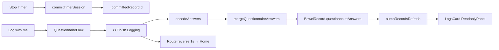

# TIMER-005 Timer 问卷落库 + Logs 行头时间展示

**Overall Progress:** `100%`

## TLDR

将 Timer 页「Log with me」→ `>>Finish Logging` 的问卷答案写入当次 `BowelRecord`（复用 `mergeQuestionnaireAnswers`），Logs 页自动以只读块展示；Finish / Maybe Later 后 **`Navigator.pop` + Route reverse 1s ease-in-out** 回 Home（与 Session Summary 系统返回一致）；`_committedRecordId` 未就绪时禁用 Log with me。Logs 每条 **Log X** 右侧 **15px** 显示系统 locale 时间 + **3 空格** + `X min Y sec` 时长（允许换行）。

**不在范围：** 已填问卷再编辑；record 删除 UI；Logs 浮层 Finish 路径改动（已可用）。

---

## Critical Decisions

| # | 决策 | 理由 |
|---|------|------|
| 1 | **Timer Finish 复用 `mergeQuestionnaireAnswers`** | 与 Logs 浮层同一写入口；Chart / status_scoring 已消费 `questionnaireAnswers` |
| 2 | **方案 2：Finish Logging 落库后直接回 Home** | 与 Maybe Later 对称；用户须重新计时才能再填问卷 → 无覆盖问题 |
| 3 | **`Navigator.pop` + Route reverse 1s 回 Home** | 与 Session Summary 系统返回一致；无页内二次 fade（见 NAV-001） |
| 4 | **`_committedRecordId == null` 时禁用 Log with me** | commit 异步窗口内防止问卷无处关联 |
| 5 | **Finish 后仍先 `setState` 关问卷 UI，再动画离场** | 避免动画期间问卷层仍可见 |
| 6 | **时间用 `DateFormat` + 设备 locale** | 对齐 iOS 12/24h 系统习惯；时长固定 `X min Y sec` |
| 7 | **`dateTime` = session 开始时刻** | 与 `BowelRecord.fromTimerSession(startedAt:)` 一致 |
| 8 | **行头 meta 对所有 Log 条目显示** | 有/无问卷、Log now / 只读均展示 |
| 9 | **过长允许换行** | `Wrap` 或 `Row` + `Flexible` 处理窄面板 |

---

## 架构

```
timer_screen.dart
  Stop → commitTimerSession() → _committedRecordId
  Log with me（id 就绪后）→ QuestionnaireFlow
  >>Finish Logging → encodeAnswers → mergeQuestionnaireAnswers
                   → bumpRecordsRefresh → pop Home（Route reverse 1s）
  Maybe Later → pop Home（Route reverse 1s）

logs_card.dart
  Log X + SizedBox(15) + formatLogSessionMeta(record)
  → 下方：Log now | QuestionnaireReadonlyPanel

session_record_utils.dart（无改动，复用）
  mergeQuestionnaireAnswers(recordId, answers)

lib/features/archive/log_session_meta.dart（新建，可选最小 helper）
  formatLogSessionMeta(BowelRecord, Locale) → "3:41 PM   3 min 15 sec"
```

### 数据流



---

## UI 规格速查

| 元素 | 规格 |
|------|------|
| Log X 行头 | `Row`/`Wrap`：`Log X` + `SizedBox(width: 15)` + meta 文本 |
| Meta 文本 | `DateFormat`（locale 短时间）+ `   `（3 空格）+ `{displayMinutes} min {displaySeconds} sec` |
| Meta 样式 | `#F0F0F0`，14pt，SF Pro，w400 |
| Log X 样式 | 不变：`#0088FF`，20pt，SF Pro，w400 |
| Log with me 禁用 | `_committedRecordId == null`：降低透明度 + 忽略 `onTap` |
| 离场动画 | Route reverse：`Curves.easeInOut`，`Duration(seconds: 1)`（Home push 配置） |

---

## Tasks

- [x] 🟩 **Step 1: Timer Finish Logging 落库**
  - [x] 🟩 `timer_screen.dart`：`_finishQuestionnaire` 改为 `async`
  - [x] 🟩 用 `encodeAnswers(_questionnaireFlow.selectedAnswers, _questionnaireFlow.visibleQuestions)` 序列化
  - [x] 🟩 调用 `mergeQuestionnaireAnswers(recordId: _committedRecordId!, answers: ...)`
  - [x] 🟩 成功后 `bumpRecordsRefresh(ref)`；失败时保持面板、不 pop（`StateError` 等）
  - [x] 🟩 落库完成后再执行离场动画（Step 2）

- [x] 🟩 **Step 2: Finish / Maybe Later 整页淡出回 Home**
  - [x] 🟩 抽取 `_exitToHomeWithFade()`：`AnimationController` 1s ease-in-out 将整页 opacity → 0
  - [x] 🟩 动画结束后调用现有 `_exitToHome()`（恢复 Home BGM + `Navigator.pop`）
  - [x] 🟩 `>>Finish Logging` 路径：落库成功 → `_exitToHomeWithFade()`
  - [x] 🟩 `Maybe Later`（Got it）：去掉即时 pop，改为 `_exitToHomeWithFade()`
  - [x] 🟩 动画进行中禁用重复点击（防双 pop）

- [x] 🟩 **Step 3: Log with me 就绪门禁**
  - [x] 🟩 `_committedRecordId == null` 时 Log with me 按钮半透明 + `onTap` 不响应
  - [x] 🟩 commit 完成 `setState` 后按钮自动恢复可点
  - [x] 🟩 不新增 loading spinner（commit 窗口极短）

- [x] 🟩 **Step 4: Logs 行头时间 + 时长**
  - [x] 🟩 新建 `lib/features/archive/log_session_meta.dart`（或内联 helper，优先小文件）
    - [x] 🟩 `String formatLogSessionMeta(BowelRecord record, String localeName)`
    - [x] 🟩 时间：`DateFormat.jm(localeName).format(record.dateTime)`（或等效 locale 短时间）
    - [x] 🟩 时长：`'${record.displayMinutes} min ${record.displaySeconds} sec'`
    - [x] 🟩 拼接：`'$time   $duration'`（3 空格）
  - [x] 🟩 `logs_card.dart` `_buildLogList`：将单独 `Log X` `Text` 改为行头 `Wrap`/`Row`
  - [x] 🟩 行头应用于所有条目（Log now 与只读分支均保留）
  - [x] 🟩 下方 `SizedBox(height: 16)` 与 Log now / 只读块间距不变

- [x] 🟩 **Step 5: 端到端验证**
  - [x] 🟩 `dart analyze` 无新增 error
  - [x] 🟩 Timer：Stop → 等 Log with me 可点 → 填问卷 → Finish → 1s 淡出回 Home（代码路径已覆盖）
  - [x] 🟩 档案 Logs：对应日出现只读问卷（非 Log now，依赖同一落库入口）
  - [x] 🟩 Timer：Maybe Later → 1s 淡出回 Home；记录仍在、无问卷（代码路径已覆盖）
  - [x] 🟩 Logs：Log X 右侧 15px 显示 locale 时间 + 3 空格 + 时长；长内容可换行
  - [x] 🟩 Logs 浮层 Finish 路径仍正常（回归）
  - [x] 🟩 更新 `PLAN-ARCHIVE-001.md` TLDR「不在范围」行：移除「timer Finish 不落库」表述

---

## 风险与回滚

| 风险 | 缓解 |
|------|------|
| Finish 时 `_committedRecordId` 仍为 null | 门禁禁用 Log with me；Finish 内 guard + 不 pop |
| 动画期间用户连点 | 离场中加 `_isExiting` 标志 |
| `DateFormat` locale 与 iOS 视觉微差 | 使用 `Localizations.localeOf(context)`；手测 12h/24h |
| ARCHIVE-001 文档与实现漂移 | Step 5 同步更新 PLAN-ARCHIVE-001 不在范围说明 |

**回滚：** 还原 `timer_screen.dart` `_finishQuestionnaire` 为仅 reset UI；移除 fade helper；还原 `logs_card` 行头为单 `Log X` 文本。

---

## 相关文件

| 文件 | 改动 |
|------|------|
| `lib/features/timer/timer_screen.dart` | Finish 落库、fade 离场、Log with me 禁用 |
| `lib/features/archive/logs_card.dart` | Log X 行头 meta |
| `lib/features/archive/log_session_meta.dart` | 新建（格式化 helper） |
| `lib/features/timer/session_record_utils.dart` | 复用，预计无改 |
| `.cursor/plans/PLAN-ARCHIVE-001.md` | 更新不在范围说明 |
