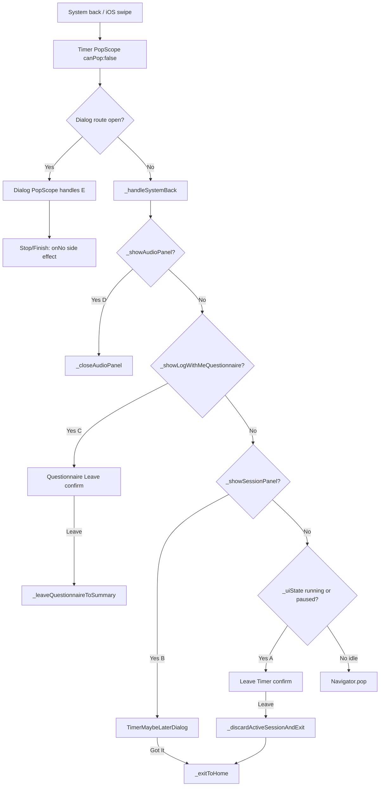

# TIMER-EXIT-001 Timer 系统返回确认退出


**Overall Progress:** `90%`


## TLDR


为 Timer 页拦截系统返回（Android 返回键 / iOS 边缘滑动），按 UI 状态分流：running/paused 弹 **Leave Timer** 确认；问卷中弹 **Leave anyway** 确认并回 Session Summary；Session Summary 复用 **Maybe Later** 弹窗；idle 直接 pop。全部确认框 UI 走 `AppGlassDialog` + `showTimerGlassDialog`，不新增视觉组件。


---


## Critical Decisions


| # | 决策 | 理由 |

|---|------|------|

| 1 | **单一编排入口** `_handleSystemBack()` | 优先级 ladder 集中在一处，避免 PopScope / 按钮 / 弹窗多处分叉 |

| 2 | **弹窗 widget 放 `timer_dialogs.dart`** | 与 Stop / Maybe Later 同文件；仅薄封装 `AppGlassDialog.confirm`，零新视觉 |

| 3 | **E（先关弹窗）由 dialog widget 内 PopScope 负责** | `showDialog` 路由在 Timer 之上消费返回键；Stop / Finish 的 PopScope 调用 `onNo`，等同 Cancel / 恢复计时 |

| 4 | **A Leave 抽 `_discardActiveSessionAndExit()`** | 丢弃 running/paused 状态（停 tick、warm、音频、重置 UI）后调现有 `_exitToHome()`；不写 record |

| 5 | **C Leave 抽 `_leaveQuestionnaireToSummary()`** | `setState` 关问卷 + `_resetQuestionnaireFlow()`；停留 Session Summary，record 已存在不动 |

| 6 | **B 复用 `_showMaybeLaterDialog()`** | 不新建弹窗；系统返回 ≡ 点 Maybe Later（B2） |

| 7 | **idle 直接 pop** | `canPop: false` + handler 内分支 pop；音频随 dispose 停（Q3-b），不额外 stop |

| 8 | **统一 `PopScope(canPop: false)`** | Timer 层永不自动 pop；所有出口经 `_handleSystemBack()` 显式决策 |

| 9 | **Home BGM 不 resume** | 沿用 HOME-003；`_exitToHome()` 已符合，本 ticket 不改 |

| 10 | **不测 `_handleSystemBack` 全状态机** | 仅 widget test 两个新 dialog 文案/按钮；状态机靠手动测试清单 |


---


## 架构


```

timer_screen.dart（编排）

  ├── PopScope(canPop: false) → _handleSystemBack()

  ├── _handleSystemBack()          // 优先级 ladder

  ├── _discardActiveSessionAndExit() // A · Leave

  ├── _leaveQuestionnaireToSummary() // C · Leave

  ├── _showLeaveTimerDialog()        // A

  ├── _showQuestionnaireLeaveDialog() // C

  └── _showMaybeLaterDialog()        // B（已有）


timer_dialogs.dart（弹窗）

  ├── TimerLeaveTimerConfirmDialog      // 新建 · A

  ├── TimerQuestionnaireLeaveConfirmDialog // 新建 · C

  ├── TimerStopConfirmDialog            // 补 PopScope · E

  └── TimerFinishSessionDialog          // 补 PopScope · E


app_glass_dialog.dart（已有，不改）

  └── AppGlassDialog.confirm + showAppGlassDialog

```


### 系统返回分流（优先级）





### 弹窗文案（锁定）


| ID | Title | Cancel | 主操作 |

|----|-------|--------|--------|

| **A** | `Leave Timer?\n\nThis session won't be saved.` | Cancel | Leave |

| **C** | `You haven't finished logging.\n\nLeave anyway?` | Cancel | Leave |

| **B** | （已有 Maybe Later 单按钮文案） | — | Got It (Back to Home) |


---


## Tasks


- [x] 🟩 **Step 1: 新建确认弹窗 widget** — `lib/features/timer/widgets/timer_dialogs.dart`

  - [x] 🟩 `TimerLeaveTimerConfirmDialog`：`AppGlassDialog.confirm`，文案/按钮见上表 A；`onLeave` / `onCancel` 回调内 `Navigator.pop` + 业务回调（同 `TimerStopConfirmDialog` 模式）

  - [x] 🟩 `TimerQuestionnaireLeaveConfirmDialog`：文案/按钮见上表 C；同上模式

  - [x] 🟩 `TimerStopConfirmDialog`：外层包 `PopScope(canPop: false)`，`onPopInvokedWithResult` 在 `!didPop` 时执行与 Cancel 相同的 `onNo` 路径（E）

  - [x] 🟩 `TimerFinishSessionDialog`：同上 PopScope + `onNo`（E）


- [x] 🟩 **Step 2: Timer 页返回编排** — `lib/features/timer/timer_screen.dart`

  - [x] 🟩 替换现有 `PopScope`：`canPop: false`，`onPopInvokedWithResult` 在 `!didPop` 时调 `_handleSystemBack()`；删除 post-pop 音频 stop 逻辑（改由 discard / exit 路径负责）

  - [x] 🟩 实现 `_handleSystemBack()`：

    - D：`_showAudioPanel` → `_closeAudioPanel()` return

    - C：`_showLogWithMeQuestionnaire` → `_showQuestionnaireLeaveDialog()` return

    - B：`_showSessionPanel && !_showLogWithMeQuestionnaire` → `_showMaybeLaterDialog()` return

    - A：`_uiState == running \|\| paused` → `_showLeaveTimerDialog()` return

    - idle：`Navigator.pop(context)` return

  - [x] 🟩 实现 `_showLeaveTimerDialog()` / `_showQuestionnaireLeaveDialog()`：`showTimerGlassDialog` + 对应 widget

  - [x] 🟩 实现 `_discardActiveSessionAndExit()`：cancel `_timer`、`_stopWarm()`、重置 `_uiState`/elapsed/session 字段、`_resetAudioOnSessionEnter()` 等价清理（无 session panel）、`_sessionStartedAt = null`；然后 `_exitToHome()`

  - [x] 🟩 实现 `_leaveQuestionnaireToSummary()`：`setState` 设 `_showLogWithMeQuestionnaire = false` + `_resetQuestionnaireFlow()`；**不** pop 路由

  - [x] 🟩 确认 `_handlingBackNavigation` / `_isExiting` 在 discard / exit 路径防重入（复用 `_exitToHome` 已有 guard）


- [x] 🟩 **Step 3: Widget 测试** — `test/timer_exit_dialogs_test.dart`（新建）

  - [x] 🟩 `TimerLeaveTimerConfirmDialog`：断言 title 含 `Leave Timer?` / `This session won't be saved.`；存在 `Cancel` / `Leave`

  - [x] 🟩 `TimerQuestionnaireLeaveConfirmDialog`：断言 title 含 `You haven't finished logging.` / `Leave anyway?`；存在 `Cancel` / `Leave`

  - [x] 🟩 Tap Leave / Cancel 触发 `Navigator.pop`（mock callback 被调用）


- [ ] 🟨 **Step 4: 手动验证**

  - [ ] 🟥 idle + 可选音频：系统返回直接回 Home，无弹窗

  - [ ] 🟥 running：返回 → A 弹窗；Cancel 继续计时；Leave 回 Home 且无新 record

  - [ ] 🟥 paused：同上

  - [ ] 🟥 Stop 确认打开：返回 ≡ Cancel（恢复 running）

  - [ ] 🟥 音频面板开：第一次返回关面板；第二次返回走 A

  - [ ] 🟥 Session Summary：返回 → Maybe Later → Got It 回 Home，record 保留

  - [ ] 🟥 问卷中：返回 → C 弹窗；Leave 回 Summary 且答案丢弃；Cancel 留问卷

  - [ ] 🟥 iOS 模拟器边缘滑动返回：行为与 Android 返回键一致


---


## 不在范围


- 修改 `AppGlassDialog` / `showAppGlassDialog` API

- Timer 页内新增可见返回按钮

- Home BGM resume 逻辑变更

- 问卷 merge / Finish Logging 流程变更

- idle 退出时主动 `stop()` Timer 音频（Q3-b：dispose 自然停）


---


## Rollback


1. Revert `timer_screen.dart` PopScope 与新增 handler 方法

2. Revert `timer_dialogs.dart` 两个新 widget + Stop/Finish PopScope

3. 删除 `test/timer_exit_dialogs_test.dart`


无 schema / 迁移风险。


---


## 风险


| 风险 | 缓解 |

|------|------|

| Stop 弹窗系统返回未恢复计时 | Step 1 PopScope 显式调 `onNo` |

| `_closeAudioPanel` 动画未完成即二次返回 | 关面板后 `return`；用户需再按一次返回（符合 D 规格） |

| `_discardActiveSessionAndExit` 遗漏 warm/audio | 复用 `_stopWarm()` + `_resetAudioOnSessionEnter()` 已有清理 |


